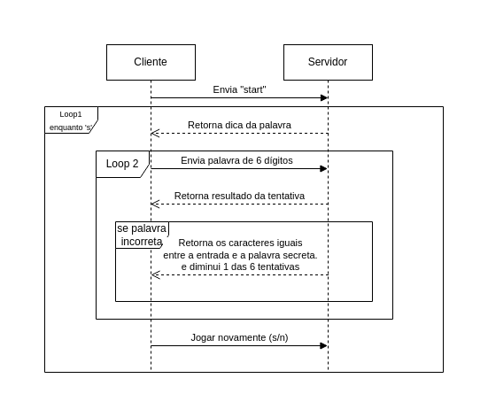

# Guess the word

Este é um pequeno jogo desenvolvido em Java para demonstrar uma conexão via socket, como parte do estudo de redes do curso de Ciência da Computação.

## Descrição

O objetivo é adivinhar a palavra secreta de 6 dígitos com base em uma breve descrição fornecida pelo servidor. O jogador só pode enviar outra palavra de 6 dígitos como tentativa, não caracteres individuais. O jogador tem um limite de 6 tentativas para acertar a palavra correta.

Ao enviar a palavra para o servidor, o servidor informará se a palavra está correta ou não. Se estiver incorreta, o servidor também indicará quais caracteres estão em comum entre a palavra enviada e a palavra secreta, auxiliando o jogador a aumentar suas chances de acerto.

## Fluxo



## Pré-requisitos

- Java 17 ou superior instalado

## Instalação e Uso

1. Clone o repositório:

   ```bash
   git clone https://github.com/joaorodriguesz/guess-the-word
   ```

2. Navegue até o diretório:

   ```bash
   cd guess-the-word/out/artifacts/guess_the_word_jar
   ```

4. Execute os arquivos JAR 

   ```bash
   java -jar server.jar
   
   java -jar client.jar <IP>
   ```

### OBS:

> *A aplicação ira executar por padrão na porta 8088*
